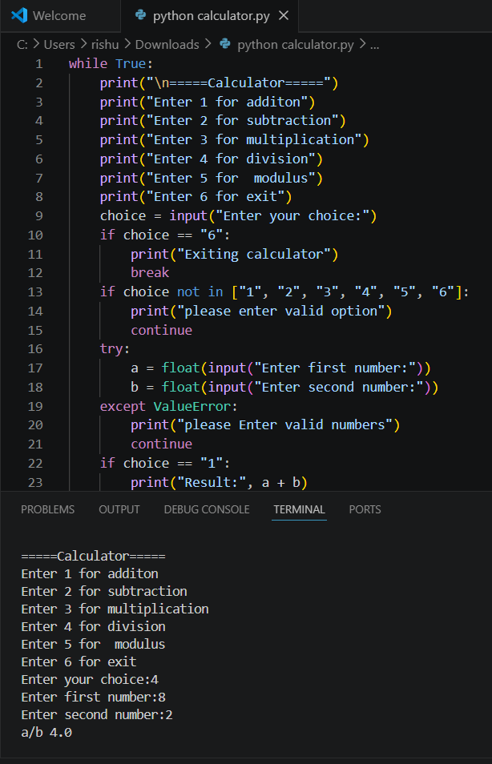

# 🧮 Python Calculator

This is a basic calculator built using Python.  
It can perform different arithmetic operations based on user input.

## 🚀 Features
- Addition
- Subtraction
- Multiplication
- Division
- Modulus
- Error handling for invalid input
- Loop-based menu system

## 🖥️ How to Run
1. Make sure Python is installed
2. Download or clone this repository
3. Run the file:
## Output Screenshot

